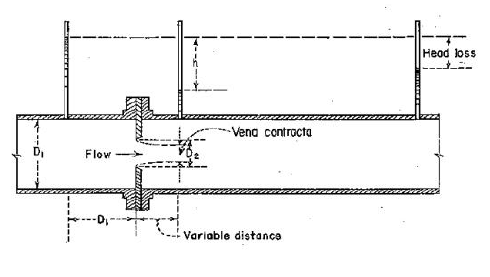
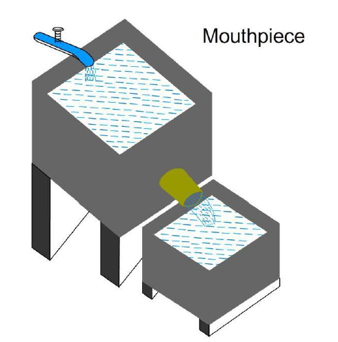

A mouthpiece is a short tube attached to an orifice provided in the side or bottom of a tank or vessel through which a liquid flows under pressure. Generally, the length of a mouthpiece is about two to three times its diameter. Compared to a simple orifice, a mouthpiece allows a greater quantity of liquid to be discharged under the same head due to the development of a partial vacuum within the tube.

Mouthpieces are widely used in hydraulic engineering for measuring and controlling the discharge of liquids from tanks and reservoirs. They are commonly classified as external or internal mouthpieces depending on their position with respect to the tank wall. An external cylindrical mouthpiece is one of the most commonly used types and is considered in this experiment.

The flow through a mouthpiece is governed by the principle of conservation of energy. As the liquid flows from the tank through the mouthpiece, pressure energy is converted into kinetic energy. Bernoulli's theorem can be applied between the free surface of the liquid in the tank and the outlet of the mouthpiece to analyse the flow.

Bernoulli's equation states that the total mechanical energy of a steady, incompressible, and frictionless fluid flowing along a streamline remains constant and is given by

$$
\frac{P_1}{\rho g}
+
\frac{V_1^2}{2g}
+
Z_1
===

\frac{P_2}{\rho g}
+
\frac{V_2^2}{2g}
+
Z_2.
$$

Where:

- $P$ = Pressure of the fluid, $\mathrm{N/m^2}$,
- $\rho$ = Density of the fluid, $\mathrm{kg/m^3}$,
- $V$ = Velocity of flow, $\mathrm{m/s}$,
- $g$ = Acceleration due to gravity, $\mathrm{m/s^2}$,
- $Z$ = Elevation above a reference datum, $\mathrm{m}$.

For a large tank open to the atmosphere,

- The pressure at the free surface and the outlet is atmospheric,
- The velocity at the free surface is negligible,
- The difference in elevation between the free surface and the outlet is the head, $H$.

Under these conditions, the theoretical velocity of discharge is

$$
V_t=\sqrt{2gH}.
$$

The theoretical discharge through the mouthpiece is

$$
Q_t=A\sqrt{2gH},
$$

where

- $Q_t$ = Theoretical discharge,
- $A$ = Cross-sectional area of the mouthpiece.

In actual conditions, frictional losses and flow contraction affect the discharge. The actual discharge is therefore less than the theoretical discharge and is given by

$$
Q_a=C_dQ_t,
$$

where

- $Q_a$ = Actual discharge,
- $C_d$ = Coefficient of discharge.

The coefficient of discharge is expressed as

$$
C_d=\frac{Q_a}{Q_t}.
$$

For an external cylindrical mouthpiece, the liquid jet first contracts after entering the mouthpiece and forms a vena contracta. Beyond this section, the jet expands and fills the entire cross-section of the mouthpiece. The pressure at the vena contracta becomes lower than atmospheric pressure, creating a partial vacuum that increases the rate of discharge compared to a simple orifice.

<em>Figure 1: Flow through an external cylindrical mouthpiece showing the formation of the vena contracta.</em>

Depending on the flow conditions, a mouthpiece may operate in two different modes:

- **Running free:** The jet contracts and does not completely fill the mouthpiece.
- **Running full:** The jet expands after the vena contracta and completely fills the mouthpiece, resulting in a higher discharge.

The experimental setup consists of a water tank fitted with a cylindrical mouthpiece and a piezometer for measuring the water head. Water discharged through the mouthpiece is collected in a measuring tank over a known interval of time. The actual discharge is determined experimentally, while the theoretical discharge is calculated using Bernoulli's equation. The coefficient of discharge is then obtained by comparing the actual and theoretical values.

<em>Figure 2: Experimental setup for determining the coefficient of discharge of a mouthpiece.</em>

The study of mouthpiece flow is important in hydraulic engineering because mouthpieces are used in tanks, reservoirs, water distribution systems, hydraulic machinery, and various flow-control devices. The determination of the coefficient of discharge helps engineers accurately predict the flow characteristics and improve the design of hydraulic structures.
